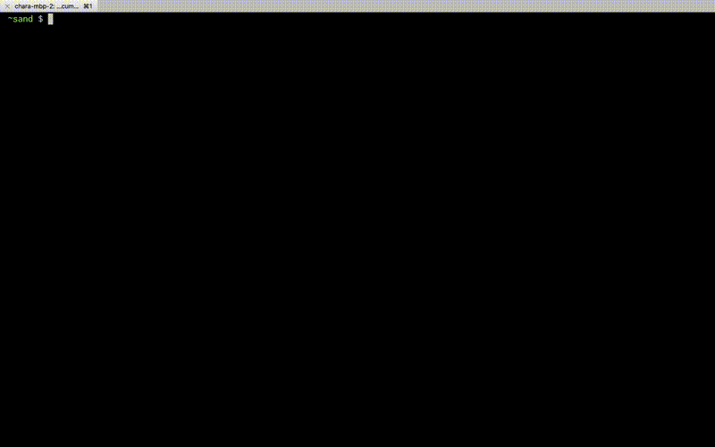
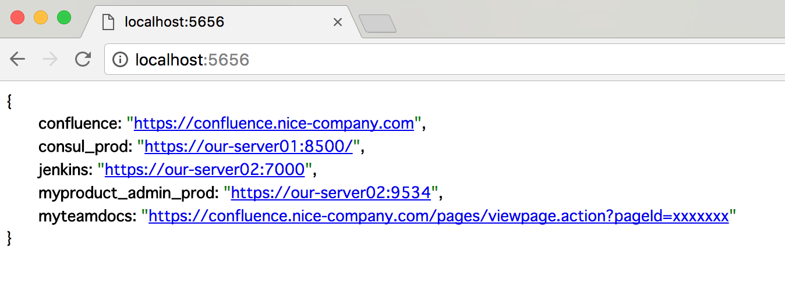
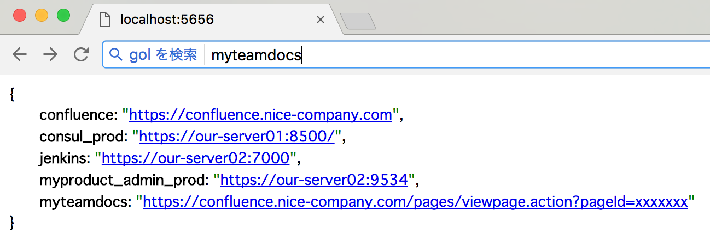
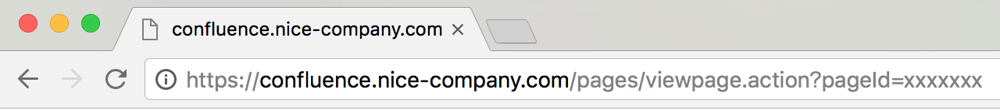

# gol

gol(go link) is a url shortner that run in cli and browser.

[](https://travis-ci.org/matsu-chara/gol)
[](https://goreportcard.com/report/github.com/matsu-chara/gol)

## Usage

### in cli



```bash
$ gol add confluence https://confluence.nice-company.com
$ gol add myproduct https://github.nice-company.com/myteam/myproduct
$ gol add myteamdocs https://confluence.nice-company.com/pages/viewpage.action?pageId=xxxxxxx
$ gol add jenkins_dev https://dev.jenkins.nice-company.com/
$ gol add jenkins_prod https://dev.jenkins.nice-company.com/
$ gol add consul_prod https://our-server01:8500/
$ gol add myproduct_admin_prod https://our-server02:9534

$ gol ls
confluence: https://confluence.nice-company.com
consul_prod: https://our-server01:8500/
jenkins_dev: https://dev.jenkins.nice-company.com/
jenkins_prod: https://dev.jenkins.nice-company.com/
myproduct: https://github.nice-company.com/myteam/myproduct
myproduct_admin_prod: https://our-server02:9534
myteamdocs: https://confluence.nice-company.com/pages/viewpage.action?pageId=xxxxxxx

$ gol get jenkins_dev
https://dev.jenkins.nice-company.com/

$ gol rm consul_prod
$ gol get consul_prod

$ gol open myteamdocs
# open in browser (need open command)
$ gol peco jenkins
# search jenkins* and select in peco and open in browser (need peco and open command)
```

### in browser

#### run server

```bash
# run server at localhost:5656
$ gol server

# or run in background and restart always
$ docker-compose up -d
```

### API

#### dump
access `localhost:5656` dumps all links


#### get

access `localhost:5656/${key}` to get value

#### post

`curl -d value=${some_url} localhost:5656/${key}` add a link to key

`curl -d "value=${some_url}&force=true" localhost:5656/${key}` add a link to key (if replace key when conflict)

#### delete

`curl -X DELETE localhost:5656/${key}` delete a link


#### setting chrome

Open Chrome > Preference > add Search Engine > add below

```
- name: gol
- keyword: gol
- query: http://localhost:5656/%s
```

#### go-link in chrome!

then, you can open gol links by
click url bar > type 'gol' > tab > type key > enter

type `gol` >  tab > type key


then enter > jump to the link!


## Install

To install, use `go get`:

```bash
$ go get github.com/matsu-chara/gol
```

## zsh completion

https://gist.github.com/3tty0n/0ef541bb9fce758c4c064ce96ba83a91
